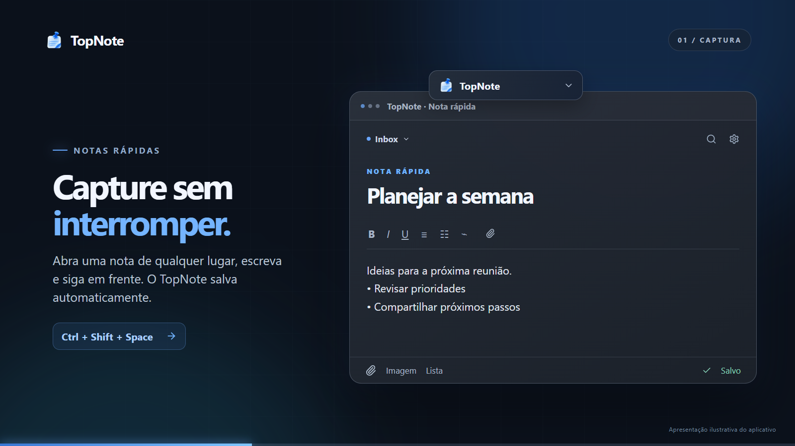

<p align="center">
  
</p>

<h1 align="center">TopNote</h1>

<p align="center">
  Notas rápidas para Windows, sempre ao alcance de um atalho.
  <br />
  Capture ideias, organize projetos e mantenha seus arquivos no seu computador.
</p>

<p align="center">
  <a href="releases/TopNote_0.1.3_x64-setup.exe"><strong>Baixar para Windows</strong></a>
  · <a href="media/TopNote-promo.mp4">Ver apresentação (30 s)</a>
  · <a href="#desenvolvimento">Desenvolvimento</a>
</p>

## Conheça o TopNote

[](media/TopNote-promo.mp4)

*Clique na imagem para assistir ao vídeo. As telas do vídeo são uma apresentação ilustrativa dos recursos do aplicativo.*

O TopNote combina uma cápsula discreta na área de trabalho com um editor rápido e um Workspace para notas maiores. O atalho global `Ctrl + Shift + Space` abre uma nota sem interromper a tarefa atual. O conteúdo é salvo automaticamente em um banco local.

| Recurso | O que faz |
| --- | --- |
| **Captura rápida** | Abre e recolhe o editor com um atalho global. A cápsula pode ficar quase invisível até receber o mouse. |
| **Organização** | Agrupa notas na Inbox, em projetos e em pastas. Mostra favoritos, recentes, arquivo e lixeira. |
| **Editor** | Oferece títulos, listas, checklists, imagens, links, blocos de código e histórico de versões. |
| **Anexos** | Aceita arquivos por seleção, colagem ou arraste; permite abrir, localizar no Explorer e copiar para outra pasta arrastando. |
| **Busca** | Pesquisa notas e abre comandos com `Ctrl + K`. |
| **Dados locais** | Mantém banco e anexos no computador, com backup manual ou automático. |
| **Preferências** | Ajusta tema, transparência, atalho, monitor, cápsula e inicialização com o Windows. |

## Instalação

1. Baixe o [instalador do TopNote 0.1.3 para Windows 64 bits](releases/TopNote_0.1.3_x64-setup.exe).
2. Execute o instalador e abra **TopNote** pelo menu Iniciar.
3. Conclua as três telas de apresentação na primeira execução.

Compatível com **Windows 10 e 11**. O instalador usa o WebView2; se ele não estiver presente, sua instalação pode exigir internet. O executável ainda não é assinado digitalmente, então o Windows pode mostrar um aviso do SmartScreen. Verifique a origem do arquivo antes de prosseguir.

**SHA-256 do instalador 0.1.3:** `578AEB5532A44040BFAF6E004B676927A5C3581243F7F8A1113C73E3B932E6D1`.

### Primeiros passos

1. Pressione `Ctrl + Shift + Space` ou clique na cápsula para abrir o editor rápido.
2. Escreva um título e o conteúdo. O indicador **Salvo** confirma a gravação automática.
3. Clique no nome do projeto no cabeçalho para abrir o seletor de notas. Use o **+** junto ao projeto para criar outra nota nele.
4. Abra o **Workspace** pelo menu **Mais ações** para organizar notas em projetos e pastas.
5. Solte arquivos no editor para anexá-los. A lista de anexos aparece após a importação; arraste um anexo pelo nome até o Explorer para copiar o arquivo.

### Atalhos

| Atalho | Ação |
| --- | --- |
| `Ctrl + Shift + Space` | Abrir ou recolher o editor rápido; configurável em **Configurações → Atalhos** |
| `Ctrl + K` | Pesquisar notas e comandos |
| `Ctrl + N` | Criar nota |
| `Ctrl + Shift + N` | Criar projeto |
| `Ctrl + P` | Abrir o seletor de projetos |
| `Ctrl + Enter` | Salvar imediatamente |
| `Esc` | Recolher o editor rápido |

## Dados e backup

O TopNote não exige conta. O banco SQLite, os anexos e os backups ficam em `%LOCALAPPDATA%\com.topnote.desktop\`:

```text
topnote.db
attachments\
backups\
topnote.log
```

Em **Configurações → Dados**, é possível criar ou restaurar um backup ZIP e ativar backups automáticos diários ou semanais. Restaurar um backup substitui os dados atuais, após confirmação no aplicativo. A opção **Iniciar com o Windows** fica em **Configurações → Geral**.

## Desenvolvimento

**Requisitos:** Node.js e npm; Rust via rustup; Visual Studio Build Tools com compilador C++ e Windows SDK.

```powershell
npm ci
npm run desktop:dev
```

Validação local:

```powershell
npm run build
npm test -- --configLoader runner
cd src-tauri
cargo test --locked
```

Para gerar o executável e o instalador NSIS:

```powershell
npm run desktop:build
```

Os artefatos saem em `src-tauri/target/release/` e `src-tauri/target/release/bundle/nsis/`. O instalador pronto para compartilhar está em [`releases/`](releases/).

### Vídeo de apresentação

O vídeo de 30 segundos foi criado em [Remotion](https://www.remotion.dev/) com telas ilustrativas e dados fictícios. O projeto editável está em [`promo/`](promo/), separado das dependências do aplicativo.

```powershell
cd promo
npm ci
npm run studio  # prévia e edição
npm run render  # gera media/TopNote-promo.mp4
npm run poster  # gera media/TopNote-poster.png
```

O Remotion pode baixar um navegador para renderizar. Se o Chrome já estiver instalado, use a opção `--browser-executable` da CLI para apontar para ele. Consulte o [guia de renderização](https://www.remotion.dev/docs/cli/render).

## Estrutura

| Diretório | Conteúdo |
| --- | --- |
| [`src/`](src/) | Interface React, editor e serviços da aplicação |
| [`src-tauri/`](src-tauri/) | Janelas nativas, comandos, banco SQLite, anexos e backup |
| [`promo/`](promo/) | Código-fonte do vídeo em Remotion |
| [`media/`](media/) | Vídeo e imagem de apresentação |
| [`releases/`](releases/) | Instaladores compartilháveis |

## Licença

Distribuído sob a licença MIT. Consulte [`LICENSE`](LICENSE).
